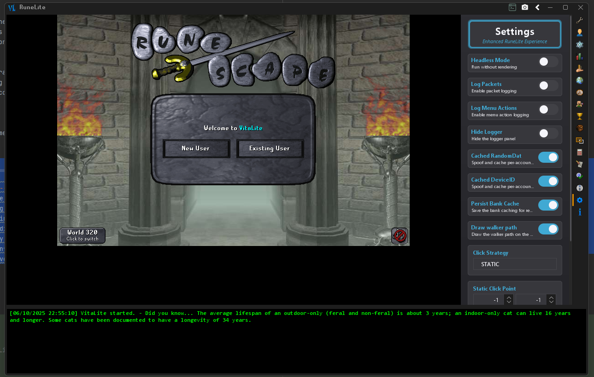

# VitaLite
VitaLite is a launcher for RuneLite that offers additional features and customization options.
- Provides access to aditional GamePack functionalities
- Robust built-in API SDK for plugin development
- Builtin plugins including profiles which allows you to use your Jagex Accounts directly from the client and swap between
- Dual-layered mixin system for modifying both RuneLites classes and the GamePack
- And more

## Side-Loading Plugins
- **External Plugin Support:** Load and manage external plugins not available in the official RuneLite repository.
  Add your plugins to the `~\.runelite\sideloaded-plugins` folder for them to load

## General User Release
Grab the Launcher From [https://github.com/Tonic-Box/VitaLauncher/releases](https://github.com/Tonic-Box/VitaLauncher/releases).

### General Use Features
[Client QoL User Features](./docs/FEATURES.md)

## Developers
[SDK Docs](./docs/SDK-DOCS.md)
[Plugin Dev Guide](./docs/EXTERNALPLUGIN.md)
[Click Manager Docs](./docs/CLICKMANAGER.md)

### Building from source
- Run the `SyncRuneliteApi` gradle task to download the latest RuneLite API _(Only need to run Once each rev update and first time you build)_
1. Run the `buildAndPublishAll` gradle task to build the artifacts and setup the main module correctly
2. Run the `com.tonic.VitaLite` main class to launch the client

## Contributing
1. Fork the repository
2. Create a feature branch
3. Make your changes
4. Test thoroughly
5. Submit a pull request

## Client Command Line Options
| Option       | Type    | Description                                          |
|--------------|---------|------------------------------------------------------|
| `--rsdump`   | String  | Path to dump the gamepack to (optional)              |
| `-noPlugins` | Boolean | Disables loading of core plugins                     |
| `-min`       | Boolean | Runs jvm with minimal alotted memory.                |
| `-noMusic`   | Boolean | Prevent the loading of music tracks                  |
| `-incognito` | Boolean | Visually display as 'RuneLite' instead of 'VitaLite' |
| `-help`      | Boolean | Displays help information about command line options |
| `-proxy`     | String  | Set a proxy server to use (e.g., ip:port or ip:port:username:password) |

## Disclaimer

VitaLite is a third-party loader for RuneLite. Use at your own risk. The developers are not responsible for any consequences resulting from the use of this software.

## [Buy me a coffee](https://ko-fi.com/tonicbox)